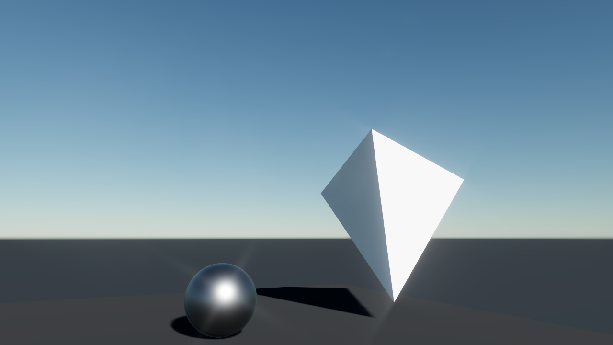
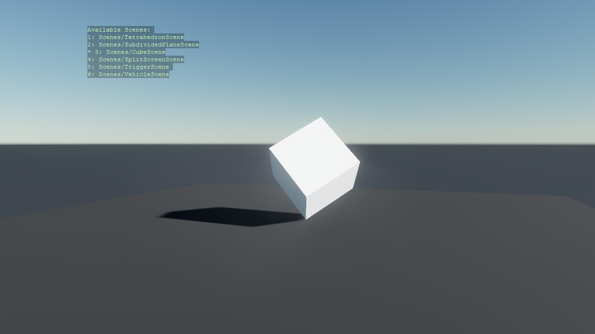
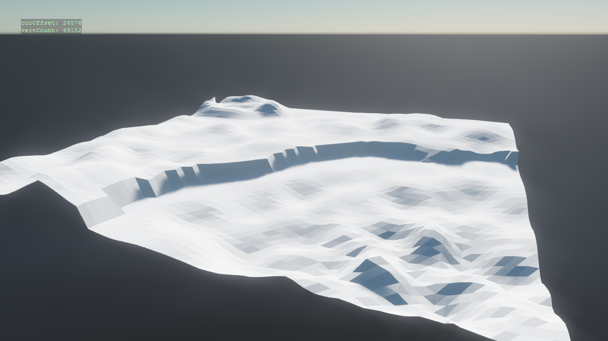
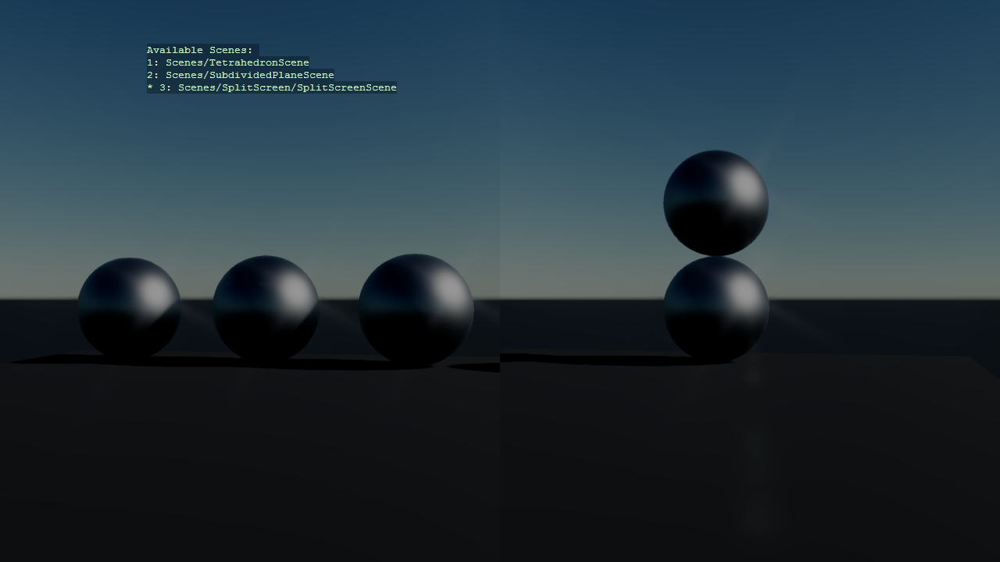
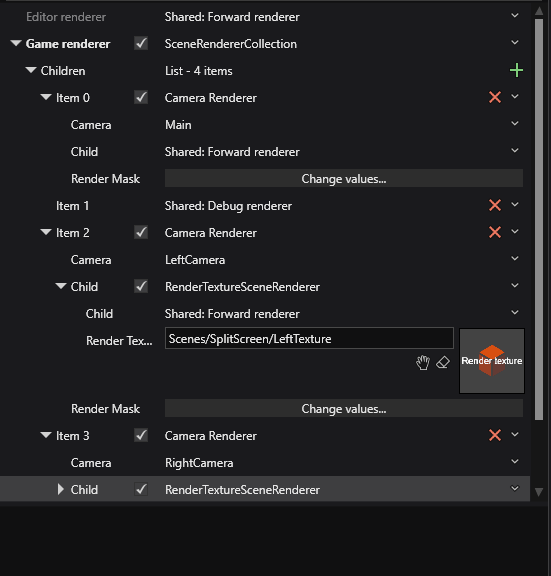
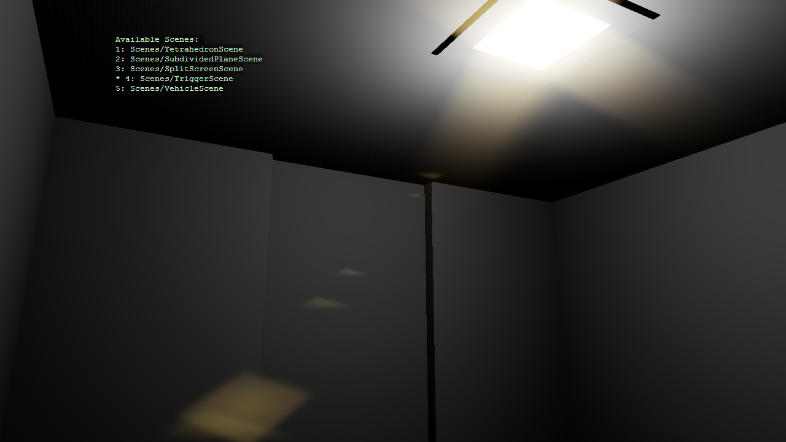
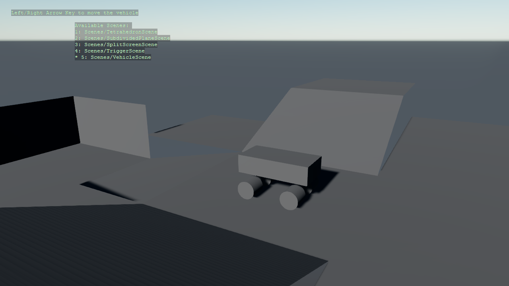

XenkoByteSized
---------------
Intended as a sort of dumping ground for various small samples of using Xenko to do various things, like procedurally generate meshes.

Project is currently on **Xenko 3.1.0.1-beta02-0527**.

## [XenkoByteSized.ProceduralMesh.TetrahedronMesh](XenkoByteSized/ProceduralMesh/TetrahedronMesh.cs)
A simple example of creating a mesh procedurally by supplying vertices, also calculates normals automatically. Can be observed in the scene that loads when you open the project aside from the source itself.

Uses only a vertex buffer to be as simple as possible.

## [XenkoByteSized.ProceduralMesh.Cubemesh](XenkoByteSized/ProceduralMesh/CubeMesh.cs)
Another example of creating a mesh procedurally, in this case **with** with an index buffer and instead for a cube (as it makes sense finally to use an index buffer here)

24 vertices, 36 indices.

## [XenkoByteSized.ProceduralMesh.SubdividedPlaneMesh](XenkoByteSized/ProceduralMesh/SubdividedPlaneMesh.cs)

A somewhat less simple example of expanding upon the above, generates a subdivided plane with a configurable width, height and number of subdivisions in each quadrant.

**Does not yet have proper collision.** (Heightfield collider pending)

Still does not use any index buffer, probably should.

Has some basic operations possible like:
 * Raising/Lowering terrain (Left/Middle Mouse)
 * Smoothing terrain (Shift + Left Mouse)
 * Leveling terrain (Ctrl + Left Mouse)

(scrollwheel to change marker radius for the above)

Can also be observed in the same scene

## **XenkoByteSized.SplitScreen**
A fixed size splitscreen example, with the view being split up in left and right and rendered by different cameras.

This one is slightly harder to simply link to some code to illustrate, you'll want to explore the following to see whats going on: 
* **Scenes/SplitScreenScene**
* **Scenes/SplitScreen/SplitScreenCompositor**
* **Scenes/SplitScreen/LeftTexture**
* **Scenes/SplitScreen/RightTexture**

The scene itself:

A relevant piece of the compositor setup, where the default **CameraRenderer** at the root has been replaced by a **SceneRenderCollection**, as can be seen in [this page on the Xenko Docs about render targets](https://doc.xenko.com/latest/en/manual/graphics/graphics-compositor/render-textures.html).

### Misc Considerations
Of the most important bits to consider here are:
* The main renderer renders only the sprites for each of the render textures, (Group 31 in our case), while the render targets render everything **except** Group 31 (can be observed by looking at the **RenderMask** in the GraphicsCompositor for each renderer).
* I created a [special script](XenkoByteSized/SplitScreen/Screen.cs) which just takes the center offset at which to place the render texture on screen, a reference to the render texture, the render group it should be in (to not be rendered by the split screen cameras) and creates the sprite for it.
* I made sure the main camera goes through a forward renderer without postfx (so render left and apply postfx, render right and apply postfx, then the main path composits but does not apply postfx).

## **XenkoByteSized.TriggerScene** - [DoorScript](XenkoByteSized/TriggerScene/DoorScript.cs)
A small two room scene that uses a trigger volume to show/hide a door and enable/disable its collider so the player can pass through.
Also comes with a `PlayerController` set up with a simple capsule collider so you can walk around in the small scene.

The scene itself is composed entirely out of primitives.

(might revisit this to make the door not just pop out of existence)

## **XenkoByteSized.VehicleScene** - [VehicleScript](XenkoByteSized/VehicleScene/VehicleScript.cs)

A small scene using [rigid bodies](https://doc.xenko.com/latest/en/manual/physics/rigid-bodies.html) together with constraints to create a small vehicle composed of a solid block and 4 cylinders connected to the block with a [Generic6DofConstraint](https://doc.xenko.com/latest/en/api/Xenko.Physics.Generic6DoFConstraint.html) for each cylinder, each constraint limited in rotation such that each cylinder only rotates like you might expect a wheel attached to an axle act.

So we get a vehicle that can roll on these cylinders!

To understand this sample I recommend experimenting with it, changing the type of constraint and adjusting limits etc.

(will probably revisit this to let the front wheels turn)

## Misc
The sample also switches out the graphics compositor to the one associated with the scene being switched to currently, currently only relevant for the **SplitScreen** sample.
